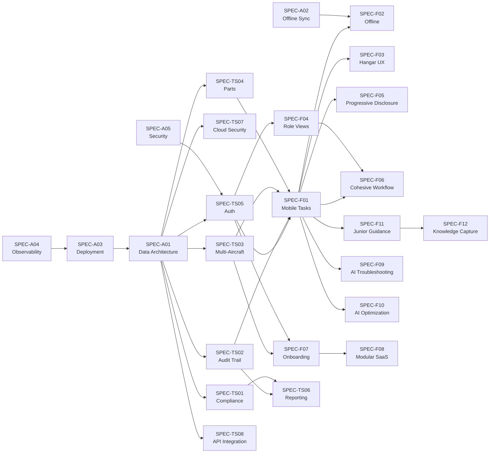

# Refinement Pipeline

Decompose Wing Works foundational documents into implementation-ready specs, review each from two perspectives, and produce a master implementation plan.

## Instructions

You are a refinement orchestrator. Your job is to read the three foundational Wing Works documents, decompose them into ~25 implementation-ready specification files, have each spec reviewed by two specialized agents, and produce a master implementation plan. Every output is optimized for AI-driven implementation loops.

### Context Budget Rules

This pipeline generates 25 specs and 50 reviews. You MUST follow these rules to avoid hitting context limits:

1. **Never hold spec content in your own context.** Delegate all spec generation and review to sub-agents that write directly to files.
2. **Always set `max_turns` on sub-agents.** Spec generators get `max_turns: 6`. Review agents get `max_turns: 4`.
3. **Process in small sequential batches.** Never spawn more than 6 agents at once.
4. **Agents return only status lines.** Instruct every agent to return ONLY a one-line status (e.g., "DONE: SPEC-F01 written" or "DONE: Approved with Concerns"). The agent writes all detailed output to files.
5. **Merge reviews incrementally.** After each review batch completes, immediately merge reviews into spec files before starting the next batch.

### Phase 1: Load Inputs

Read these three files in full:

1. `tech-stack-preferences.md` — Technology stack constraints and preferences
2. `product-requirement-brief.md` — 41 functional/non-functional requirements across 5 pillars + 8 table-stakes
3. `technical-architecture.md` — Architecture decisions, NFRs, data model, deployment, security

Also read the spec template:

4. `.claude/skills/refinement/spec-template.md` — Template for all generated specs

After reading, note the key section numbers and structure. You will reference these in agent prompts but you do NOT need to pass the full document content to agents — agents will read the files themselves.

### Phase 2: Decompose into Specs

Create the `specs/` directory structure:

```
specs/
  functional/
  table-stakes/
  architecture/
```

Generate each spec file using sub-agents. Each agent reads the source documents, generates spec content, and writes it directly to the output file.

#### Spec Manifest

##### specs/architecture/ — 5 Cross-Cutting Specs

| File | Spec ID | Domain | Source |
|------|---------|--------|--------|
| `a01-data-architecture.md` | SPEC-A01 | Data Architecture & Multi-Tenancy | technical-architecture.md Sections 6, 4.4 |
| `a02-offline-sync.md` | SPEC-A02 | Offline & Sync Architecture | technical-architecture.md Section 8 |
| `a03-deployment-cicd.md` | SPEC-A03 | Deployment, CI/CD & Infrastructure | technical-architecture.md Sections 9, 4.5, 4.6 |
| `a04-observability.md` | SPEC-A04 | Observability & Monitoring | technical-architecture.md Section 4.7 |
| `a05-security-architecture.md` | SPEC-A05 | Security Architecture | technical-architecture.md Section 10 |

##### specs/table-stakes/ — 8 Domain-Specific Specs

| File | Spec ID | Domain | PRB Requirements | Priority |
|------|---------|--------|-----------------|----------|
| `ts01-regulatory-compliance.md` | SPEC-TS01 | Regulatory Compliance Management | TS-001 | P0 |
| `ts02-maintenance-records.md` | SPEC-TS02 | Maintenance Records & Audit Trail | TS-002 | P0 |
| `ts03-multi-aircraft.md` | SPEC-TS03 | Multi-Aircraft Type Support | TS-003 | P0 |
| `ts04-parts-inventory.md` | SPEC-TS04 | Parts & Inventory Visibility | TS-004 | P0 |
| `ts05-auth.md` | SPEC-TS05 | Authentication & Authorization | TS-005 | P0 |
| `ts06-reporting-analytics.md` | SPEC-TS06 | Reporting & Analytics | TS-006 | P0 |
| `ts07-cloud-security.md` | SPEC-TS07 | Cloud-Native Architecture & Security | TS-007 | P0 |
| `ts08-api-integration.md` | SPEC-TS08 | API & External Integration | TS-008 | P0 |

##### specs/functional/ — 12 Epic-Level Specs

| File | Spec ID | Epic | PRB Requirements | Priority |
|------|---------|------|-----------------|----------|
| `f01-mobile-task-execution.md` | SPEC-F01 | Mobile Task Execution | MN-001, MN-002, MN-003, MN-004, MN-005 | P0 |
| `f02-offline-high-performance.md` | SPEC-F02 | Offline & High-Performance Mobile | MN-006, MN-007 | P0/P1 |
| `f03-hangar-optimized-ux.md` | SPEC-F03 | Hangar-Optimized UX | MN-008, MN-009, MN-010 | P0/P1 |
| `f04-role-based-views.md` | SPEC-F04 | Role-Based Views | TO-001, TO-002, TO-003 | P0/P1 |
| `f05-progressive-disclosure.md` | SPEC-F05 | Progressive Disclosure & Minimal Training | TO-004, TO-005, TO-006, TO-007 | P0/P1 |
| `f06-cohesive-workflow.md` | SPEC-F06 | Cohesive Workflow Design | TO-008, TO-009 | P0/P1 |
| `f07-guided-onboarding.md` | SPEC-F07 | Guided Onboarding & Fast Deployment | TV-001, TV-002, TV-003 | P0/P1 |
| `f08-modular-adoption-saas.md` | SPEC-F08 | Modular Adoption & SaaS Pricing | TV-004, TV-005, TV-006 | P0/P1 |
| `f09-ai-troubleshooting.md` | SPEC-F09 | AI-Assisted Troubleshooting | AI-001, AI-002 | P2 |
| `f10-intelligent-task-optimization.md` | SPEC-F10 | Intelligent Task Optimization | AI-003, AI-004 | P2 |
| `f11-guided-junior-execution.md` | SPEC-F11 | Guided Task Execution for Junior Mechanics | WM-001, WM-002 | P1 |
| `f12-knowledge-capture.md` | SPEC-F12 | Knowledge Capture & Transfer | WM-003, WM-004 | P2 |

#### Spec Generation Agent Pattern

For each spec, spawn one agent with:
- `subagent_type: "general-purpose"`
- `max_turns: 6`

Use this prompt template (fill in the bracketed values):

```
You are a spec writer for Wing Works, an aviation eMRO platform.

Your task: Generate the specification file for [SPEC-ID]: [Epic/Domain Name].

STEPS (do these in order, no extra exploration):
1. Read these files:
   - tech-stack-preferences.md
   - product-requirement-brief.md (focus on requirements: [REQUIREMENT-IDS])
   - technical-architecture.md (focus on sections: [RELEVANT-SECTIONS])
   - .claude/skills/refinement/spec-template.md
2. Generate the spec following the template exactly. Key rules:
   - Copy requirement details VERBATIM from the PRB — user stories, acceptance criteria, competitive justification
   - Map to specific technical architecture sections by reference
   - Include concrete file paths from Section 4.3, ALWAYS prefixed with the target repo name (e.g., `operations-back-end/internal/task/`, `wingman/apps/mobile/src/components/`)
   - Reference tech stack choices with justifications
   - Dependencies: [LIST-OF-DEPENDENCY-SPEC-IDS]
   - Priority: [PRIORITY]
   - If this spec spans multiple priorities (e.g., P0/P1), include a "## Phase Scope" section near the top that separates requirements, components, endpoints, and file paths by phase. Each phase subsection should be self-contained so an implementing agent can read only their phase.
   - Leave the "Architecture Review" and "Product Manager Review" sections with placeholder text: "Pending review."
3. Write the completed spec to: specs/[SUBDIR]/[FILENAME]

Return ONLY this line: DONE: [SPEC-ID] written to specs/[SUBDIR]/[FILENAME]
```

#### Generation Batches

Process spec generation in these sequential batches. Wait for each batch to fully complete before starting the next.

**Batch G1 (5 agents):** Architecture specs — SPEC-A01 through SPEC-A05
**Batch G2 (4 agents):** Table-stakes — SPEC-TS01 through SPEC-TS04
**Batch G3 (4 agents):** Table-stakes — SPEC-TS05 through SPEC-TS08
**Batch G4 (4 agents):** Functional — SPEC-F01 through SPEC-F04
**Batch G5 (4 agents):** Functional — SPEC-F05 through SPEC-F08
**Batch G6 (4 agents):** Functional — SPEC-F09 through SPEC-F12

After each batch completes, verify files exist with a quick `ls` of the target directory. Do NOT read the generated files — just confirm they were written.

#### Spec Content Guidelines

Include these instructions in every spec generation prompt:

1. **Copy requirement details verbatim** from the PRB — user stories, acceptance criteria, competitive justification. Do not paraphrase or lose detail.
2. **Map to specific technical architecture sections** — reference data model entities (Section 6), API conventions (Section 7.1), Go module structure (Section 4.3), NFR IDs (Section 2), and security controls (Section 10.2).
3. **Include concrete file paths** using the codebase structure from technical-architecture.md Section 4.3 (e.g., `internal/task/`, `pkg/api/`, `cmd/wingworks/`).
4. **Reference tech stack choices** from tech-stack-preferences.md and the technology stack table (Section 4.1) with their justifications.
5. **Identify cross-spec dependencies** — which other specs must be implemented first.
6. **Architecture specs** should focus on infrastructure, patterns, and cross-cutting concerns rather than user-facing features. Reference specific NFR IDs and decision log entries (Section 13).
7. **Phase scope isolation** — For specs that span multiple priorities (e.g., P0/P1), include a `## Phase Scope` section near the top of the spec that clearly separates requirements by phase. Each phase subsection lists ONLY the requirement IDs, components, endpoints, and file paths for that phase. This allows an implementing agent to read just the relevant phase without parsing the entire spec.

   Example structure:
   ```
   ## Phase Scope

   ### P0 Scope
   - **Requirements:** MN-006
   - **Components:** PerformanceMonitor, CacheManager
   - **Endpoints:** GET /api/v1/metrics
   - **File Paths:** internal/perf/, pkg/api/metrics/

   ### P1 Scope
   - **Requirements:** MN-007
   - **Components:** OfflineSyncEngine, ConflictResolver
   - **Endpoints:** POST /api/v1/sync
   - **File Paths:** internal/sync/, pkg/offline/
   ```

8. **Repo mapping** — Every file path in the spec MUST be prefixed with its target repository. Use these path-to-repo conventions (adjust if the project's repo mapping table differs):

   | Path Pattern | Repo |
   |---|---|
   | `internal/`, `pkg/`, `cmd/` | operations-back-end |
   | `apps/mobile/src/` | wingman |
   | `apps/web/src/` | ops-fe |

   If the project provides a different mapping, use that instead. The key rule: an implementing agent must never have to guess which repo a file path belongs to.

### Phase 3: Dual-Agent Review

Review all 25 specs using paired review agents. Each spec gets two reviewers that run in parallel. Reviews are written to temporary files, then merged into the spec by the orchestrator.

#### Review Agent Pattern — Technical Architecture

Spawn with `subagent_type: "general-purpose"` and `max_turns: 4`:

```
You are a Technical Architecture Reviewer for Wing Works, an aviation eMRO platform.

STEPS (do these in order, no extra exploration):
1. Read the spec file: specs/[SUBDIR]/[FILENAME]
2. Read the reference document: technical-architecture.md
3. Review the spec against these criteria:
   - NFR Coverage — Are all relevant NFRs from Section 2 addressed? Flag missed NFRs by ID.
   - Data Model Alignment — Does it match Section 6.1 ER diagram? Are tenant_id, RLS, audit fields included?
   - API Consistency — Do endpoints follow Section 7.1 (REST, OpenAPI 3.1, cursor pagination, RFC 7807, JWT)?
   - Security Compliance — Are Section 10 controls satisfied (RBAC, encryption, audit logging, tenant isolation)?
   - Performance Targets — Will it meet PERF-001 through PERF-007?
   - Scalability — Multi-tenancy RLS correct? Linear scaling with fleet size (SCAL-004)?
   - Dependency Risks — Hexagonal architecture rules followed? No circular imports?
   - Offline Implications — If mobile-touching, is Section 8 offline-first respected?
4. Write your review to: specs/reviews/[SPEC-ID]-arch-review.md

   Use this format in the file:
   **Reviewer:** Technical Architecture Agent
   **Status:** [Approved / Approved with Concerns / Needs Revision]
   [Findings organized by the 8 criteria above. Be specific — cite NFR IDs, section numbers, ADR-XXX references. Keep it concise — max 40 lines.]

Return ONLY this line: DONE: [STATUS] for [SPEC-ID] arch review
```

#### Review Agent Pattern — Product Manager

Spawn with `subagent_type: "general-purpose"` and `max_turns: 4`:

```
You are a Product Manager Reviewer for Wing Works, an aviation eMRO platform.

STEPS (do these in order, no extra exploration):
1. Read the spec file: specs/[SUBDIR]/[FILENAME]
2. Read the reference document: product-requirement-brief.md
3. Review the spec against these criteria:
   - Requirement Coverage — Is every user story for this spec's requirements accounted for? List each requirement ID.
   - Acceptance Criteria Completeness — Are all AC from the PRB preserved verbatim and testable?
   - Persona Alignment — Correct primary persona? Respects goals/frustrations from Section 3?
   - Success Metric Traceability — Can Section 6 metrics be measured? Which does this spec contribute to?
   - Scope Creep Detection — Anything beyond PRB scope?
   - Out-of-Scope Violations — Conflicts with Section 7 (no ERP, no heavy maintenance, no flight ops, etc.)?
   - Priority Accuracy — Does priority match PRB Section 5?
4. Write your review to: specs/reviews/[SPEC-ID]-pm-review.md

   Use this format in the file:
   **Reviewer:** Product Manager Agent
   **Status:** [Approved / Approved with Concerns / Needs Revision]
   [Findings organized by the 7 criteria above. Be specific — cite requirement IDs, persona names, PRB sections. Keep it concise — max 40 lines.]

Return ONLY this line: DONE: [STATUS] for [SPEC-ID] pm review
```

#### Review Execution Strategy

Before starting reviews, create the reviews directory:
```
specs/reviews/
```

Process reviews in these sequential batches. For each batch, spawn BOTH reviewers per spec in parallel (so batch of 3 specs = 6 agents). Wait for the full batch to complete before proceeding.

**Batch R1 (3 specs, 6 agents):** SPEC-A01, SPEC-A02, SPEC-A03
**Batch R2 (2 specs, 4 agents):** SPEC-A04, SPEC-A05
**Batch R3 (3 specs, 6 agents):** SPEC-TS01, SPEC-TS02, SPEC-TS03
**Batch R4 (3 specs, 6 agents):** SPEC-TS04, SPEC-TS05, SPEC-TS06
**Batch R5 (2 specs, 4 agents):** SPEC-TS07, SPEC-TS08
**Batch R6 (3 specs, 6 agents):** SPEC-F01, SPEC-F02, SPEC-F03
**Batch R7 (3 specs, 6 agents):** SPEC-F04, SPEC-F05, SPEC-F06
**Batch R8 (3 specs, 6 agents):** SPEC-F07, SPEC-F08, SPEC-F09
**Batch R9 (3 specs, 6 agents):** SPEC-F10, SPEC-F11, SPEC-F12

#### Review Merge Step

After EACH review batch completes, link reviews from the spec files (do NOT embed full review content — this saves ~40% of each spec's token cost):

1. For each spec in the completed batch, read ONLY the first 3 lines of each review file to extract the Status line:
   - `specs/reviews/[SPEC-ID]-arch-review.md`
   - `specs/reviews/[SPEC-ID]-pm-review.md`
2. Edit the spec file to replace the "Architecture Review" placeholder with a one-line link and status:
   ```
   **Status:** [Approved / Approved with Concerns / Needs Revision]
   See [Architecture Review](../reviews/[SPEC-ID]-arch-review.md) for full findings.
   ```
3. Edit the spec file to replace the "Product Manager Review" placeholder with a same-format link:
   ```
   **Status:** [Approved / Approved with Concerns / Needs Revision]
   See [Product Manager Review](../reviews/[SPEC-ID]-pm-review.md) for full findings.
   ```
4. Track the review status for each spec — you will need this for the implementation plan.

**Important:** Do NOT read full review files or full spec files during merge. Read only the status line from reviews, then use the Edit tool for targeted replacement of placeholder sections. This keeps your context small and avoids wasting tokens on review content that already exists in dedicated files.

### Phase 4: Generate Implementation Plan

After all specs are written and reviewed, create `specs/IMPLEMENTATION-PLAN.md` with the sections below.

#### Agent Workflow Protocol

The implementation plan MUST begin with an agent workflow section that tells implementing agents exactly how to operate. Include this at the top of the plan:

```markdown
## Agent Workflow

### Repo Mapping

| Path Pattern | Repo | CLAUDE.md |
|---|---|---|
| `internal/`, `pkg/`, `cmd/` | operations-back-end | operations-back-end/CLAUDE.md |
| `apps/mobile/src/` | wingman | wingman/CLAUDE.md |
| `apps/web/src/` | ops-fe | ops-fe/CLAUDE.md |

### How to Pick a Task

1. Read this implementation plan and find the first unchecked item (`- [ ]`) in the lowest-numbered phase.
2. Verify all its dependencies (listed after "Depends on:") are checked off (`- [x]`).
3. If multiple unchecked items are available, work them **in the order listed** — items are ordered by priority within each phase.
4. If the task spans multiple repos (backend + frontend), complete backend first, then frontend, unless the spec says otherwise.

### How to Execute a Task

1. Open the linked spec file. If the spec has a `## Phase Scope` section, read ONLY the subsection for the current phase — skip other phases.
2. Check the repo mapping table above. All file paths in the spec are prefixed with their target repo.
3. Read the target repo's CLAUDE.md for conventions (branch naming, commit messages, architecture rules).
4. Implement the requirements. Run tests. Ensure acceptance criteria from the spec pass.

### How to Mark Completion

1. Commit and push your changes following the repo's conventions.
2. Edit this file: change `- [ ]` to `- [x]` for the completed item.
3. If only some requirements within a multi-priority spec are done (e.g., P0 but not P1), mark ONLY the specific phase entry — do not mark the other phase's entry.

### Avoiding Collisions

- Before starting work, check if the spec's checkbox is still unchecked — another agent may have claimed it.
- Use descriptive branch names: `feat/[SPEC-ID]-[short-description]` (e.g., `feat/SPEC-F05-p1-manual-references`).
```

Adjust the repo mapping table to match the actual repos discovered in the source documents.

#### Dependency Graph



#### Phased Execution

Organize specs into phases matching PRB priority. **Items within each phase are numbered in execution order** — agents should work them in the listed sequence.

**Phase 0: Foundation (Architecture)**
- Infrastructure, data architecture, security, CI/CD, observability
- These must be built first — everything else depends on them

**Phase 1: P0 — Must-Have for Launch**
- Table-stakes specs (all P0)
- Core functional specs: F01, F04, F05, F06, F07, F08
- F02 (MN-006 performance is P0, MN-007 offline is P1)
- F03 (MN-008 touch targets is P0, MN-009/010 are P1)

**Phase 2: P1 — Within 6 Months**
- F02 offline completion (MN-007)
- F03 voice/dark mode (MN-009, MN-010)
- F04 planner/director dashboards (TO-002, TO-003)
- F05 P1 completion items (TO-007)
- F06 planner workflow (TO-009)
- F07 data import (TV-003)
- F08 free pilot (TV-006)
- F11 junior mechanic guidance

**Phase 3: P2 — Future Enhancement**
- F09, F10 AI features
- F12 Knowledge capture

#### Spec Entry Format

Each spec entry in the implementation plan MUST use this format:

```markdown
- [ ] **1. SPEC-A01** — [Data Architecture & Multi-Tenancy](architecture/a01-data-architecture.md)
  - **Depends on:** None
  - **Review:** Arch: Approved | PM: Approved with Concerns
```

For multi-priority specs that appear in multiple phases, use separate entries per phase with a "What Exists" field in later phases:

```markdown
- [ ] **3. SPEC-F05 (P1)** — [Progressive Disclosure: TO-007](functional/f05-progressive-disclosure.md#p1-scope)
  - **Depends on:** SPEC-F01 (P0), SPEC-F05 (P0)
  - **What Exists (from P0):** StepSequencer, InlineHelp, ErrorBanner, GET /api/v1/help/
  - **New This Phase:** ManualReferenceLink, ManualReferenceExpander, GET /api/v1/manuals/
  - **Review:** Arch: Approved | PM: Approved
```

The "What Exists" and "New This Phase" fields tell implementing agents exactly what's already built and what delta work remains, so they don't need to read the full spec history or explore the codebase to determine current state.

### Phase 5: Generate Spec Summary Index

After the implementation plan is complete, create `specs/SPEC-INDEX.md` — a lightweight summary that lets agents understand the full landscape without opening 25 files.

Use this format:

```markdown
# Spec Index

Quick-reference summary of all 25 specs. Read the linked spec for full details.

| Spec ID | Name | Priority | Phase | Arch Review | PM Review | Depends On |
|---------|------|----------|-------|-------------|-----------|------------|
| SPEC-A01 | [Data Architecture](architecture/a01-data-architecture.md) | Foundation | 0 | Approved | Approved | None |
| SPEC-F05 | [Progressive Disclosure](functional/f05-progressive-disclosure.md) | P0/P1 | 1, 2 | Approved with Concerns | Approved | SPEC-F01, SPEC-TS05 |
| ... | ... | ... | ... | ... | ... | ... |
```

Include all 25 specs in the table, sorted by phase then by execution order within phase.

### Cross-Cutting Concerns

After the spec index, add a `## Cross-Cutting Concerns` section to the implementation plan that captures patterns every implementing agent should know — things that apply across multiple specs. Examples:

- Tenant isolation (RLS) must be present in every data-touching spec
- All API endpoints require JWT auth per Section 7.1
- Audit logging is required for all write operations
- Offline-capable features must follow Section 8 sync patterns

Pull these from the architecture specs and review findings. This prevents agents from making the same mistakes across different specs.

### Phase 6: Generate or Update CLAUDE.md

After the implementation plan and spec index are complete, create or update the project's root `CLAUDE.md` file. This is the **first file any agent reads** when entering the repo, so it must orient them to the current state of the project, point them to the right documents, and tell them how to work.

If a `CLAUDE.md` already exists, preserve any existing content that is still accurate (project description, tech stack, coding conventions, etc.) and add/update the sections below. If no `CLAUDE.md` exists, create one from scratch.

The `CLAUDE.md` MUST include these sections:

```markdown
# [Project Name]

[One-paragraph project description pulled from the foundational documents.]

## Current State

This repository has been through the refinement pipeline. The `specs/` directory contains
[N] implementation-ready specifications, reviewed by architecture and product agents.

**Implementation status:** See [IMPLEMENTATION-PLAN.md](specs/IMPLEMENTATION-PLAN.md) for the
full phased execution plan with checkboxes tracking progress.

**Quick reference:** See [SPEC-INDEX.md](specs/SPEC-INDEX.md) for a one-line summary of every spec.

## Getting Started (for Agents)

1. Read this file first.
2. Open [specs/IMPLEMENTATION-PLAN.md](specs/IMPLEMENTATION-PLAN.md) and follow the
   **Agent Workflow** section at the top — it tells you how to pick a task, execute it,
   and mark it done.
3. Each spec has a `## Phase Scope` section if it spans multiple priorities — read only
   the phase you're working on.
4. Review files live in `specs/reviews/` — consult them if you need context on architectural
   decisions or product constraints for a spec.

## Repo Mapping

| Path Pattern | Repo | Description |
|---|---|---|
| `internal/`, `pkg/`, `cmd/` | operations-back-end | Go backend services |
| `apps/mobile/src/` | wingman | React Native mobile app |
| `apps/web/src/` | ops-fe | React web frontend |

## Key Conventions

[Pull from tech-stack-preferences.md and technical-architecture.md. Include:]
- Language/framework versions
- Architecture pattern (e.g., hexagonal architecture)
- Branch naming: `feat/[SPEC-ID]-[short-description]`
- Commit message format
- Test requirements
- Any linting/formatting rules

## Cross-Cutting Rules

[Copy the cross-cutting concerns from the implementation plan — these are the rules
every agent must follow regardless of which spec they're implementing:]
- Tenant isolation (RLS) on every data-touching operation
- JWT auth on all API endpoints
- Audit logging on all write operations
- Offline-first patterns for mobile-touching features
- [Any other patterns identified during reviews]

## Directory Structure

[Brief overview of the repo layout, highlighting the specs/ directory:]

specs/                    # Implementation specs and reviews
  IMPLEMENTATION-PLAN.md  # Master plan with checkboxes — start here
  SPEC-INDEX.md           # Quick-reference table of all specs
  reviews/                # Architecture and PM review files
  architecture/           # Cross-cutting infrastructure specs
  table-stakes/           # Domain-specific baseline specs
  functional/             # Feature/epic-level specs
```

**Important rules for CLAUDE.md generation:**

1. **Keep it concise.** This file should be under 150 lines. It's an orientation document, not a comprehensive reference — link to other files for details.
2. **Use relative paths** for all links so they work regardless of where the repo is cloned.
3. **Pull real values** from the source documents — don't use placeholder text like "[insert here]". Fill in actual tech stack versions, actual conventions, actual cross-cutting rules.
4. **The repo mapping table** must match the one in the implementation plan's Agent Workflow section. If the source documents reveal different or additional repos, include them all.
5. **If a CLAUDE.md already exists**, read it first. Merge new content with existing content — don't overwrite repo-specific conventions, contributor guidelines, or other sections that the refinement pipeline didn't generate.

### Output Expectations

When complete, the project should contain:

```
CLAUDE.md                 # Agent entry point — created or updated
specs/
  IMPLEMENTATION-PLAN.md
  SPEC-INDEX.md
  reviews/
    [SPEC-ID]-arch-review.md  (25 files)
    [SPEC-ID]-pm-review.md    (25 files)
  functional/
    f01-mobile-task-execution.md
    f02-offline-high-performance.md
    f03-hangar-optimized-ux.md
    f04-role-based-views.md
    f05-progressive-disclosure.md
    f06-cohesive-workflow.md
    f07-guided-onboarding.md
    f08-modular-adoption-saas.md
    f09-ai-troubleshooting.md
    f10-intelligent-task-optimization.md
    f11-guided-junior-execution.md
    f12-knowledge-capture.md
  table-stakes/
    ts01-regulatory-compliance.md
    ts02-maintenance-records.md
    ts03-multi-aircraft.md
    ts04-parts-inventory.md
    ts05-auth.md
    ts06-reporting-analytics.md
    ts07-cloud-security.md
    ts08-api-integration.md
  architecture/
    a01-data-architecture.md
    a02-offline-sync.md
    a03-deployment-cicd.md
    a04-observability.md
    a05-security-architecture.md
```

Total: 78 files (25 specs + 50 review files + 1 implementation plan + 1 spec index + 1 CLAUDE.md).

Every spec must have both review link sections populated, and the root CLAUDE.md must exist and point to the implementation plan, before the pipeline is considered complete.
